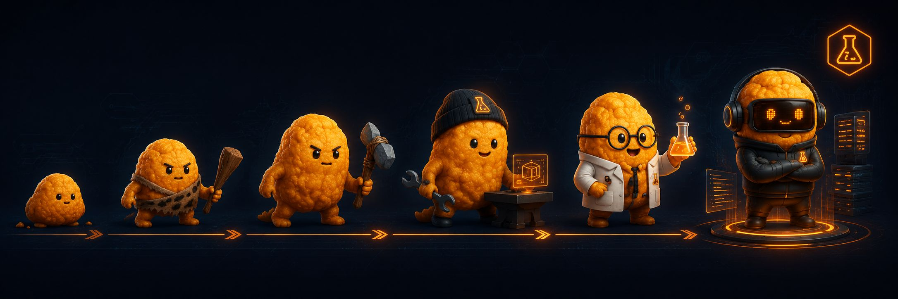

<p align="center">
  
</p>

# 🧪 Hangry Labs

**Local-first tools, baked-in images, private by default — for humanity and the power of nuggets.**

Hangry Labs builds practical, self-hostable tools that are easy to run, easy to share, and designed to keep working without depending on fragile cloud-only setups.

Our goal is simple:

- run locally
- keep your data private
- avoid painful setup rituals
- bake models/assets/dependencies where possible
- make useful tools free to use and free to share
- preserve software so it does not disappear when a service, link, or dependency breaks

Because sometimes you just want the thing to work.  
Not summon twelve dependency demons and sacrifice your weekend to Python environments.

---

## 🌍 Mission

Modern AI tools are powerful, but too many of them depend on hosted services, hidden infrastructure, disappearing model links, complex setup steps, or external accounts.

Hangry Labs takes a different approach.

We focus on **local-first, privacy-friendly, reproducible projects** where the important pieces are packaged as much as possible. When a tool needs models, assets, runtime dependencies, or special setup, we try to make that available through ready-to-run containers or clear instructions.

The ideal Hangry Labs project should feel like:

```text
docker run ...
```

and then it works.

Maybe not always perfectly. We are still fighting the dependency fires.
But that is the direction.

---

## 🔐 Private by Default

Many AI tools process personal data: voice samples, generated speech, text prompts, transcripts, documents, images, or other sensitive inputs.

Hangry Labs projects are built around the idea that users should be able to run tools on their own machines or own servers, with their own data staying under their control.

We like tools that can run:

- locally
- privately
- offline or semi-offline where possible
- behind your own authentication
- inside your own infrastructure
- without sending everything to someone else’s cloud

Privacy should not be a luxury feature.

---

## 📦 Baked Images

One of the main goals of Hangry Labs is to provide projects with **baked Docker images** where possible.

That means images may include:

- required runtime dependencies
- downloaded model assets
- preconfigured application structure
- API/UI wrappers
- setup shortcuts
- sensible defaults

The point is not to make images tiny at all costs.  
The point is to make them **survive**.

A larger image that works today, tomorrow, and next year is often better than a tiny image that breaks because one model URL vanished, one package changed, or one install command decided to explode into confetti.

---

## 🎙️ Current Focus: Local TTS and Voice Tools

Hangry Labs is currently focused on local text-to-speech, voice generation, and AI audio tooling.

Different engines have different strengths, so we treat them as a toolbox rather than forcing one model to do everything.

| Project | Purpose |
|---|---|
| **KokoroTTS** | Fast, high-quality local TTS for supported languages. Great for long-form generation and quick workflows. |
| **MeloTTS** | Stable multilingual TTS base engine and useful pipeline component. |
| **OmniVoiceTTS** | Broad multilingual TTS, voice cloning, and voice design with baked local deployment support. |

Each project aims to make powerful voice tools easier to run privately.

---

## ⚡ Speed vs Capability

Not every model should be judged by the same standard.

Some engines are excellent because they are extremely fast.  
Some are excellent because they support more languages.  
Some are excellent because they provide cloning, style control, or voice design.

Hangry Labs tries to package tools according to what they are actually good at.

```text
KokoroTTS    → fast and beautiful
MeloTTS      → stable pipeline base
OmniVoiceTTS → broad multilingual/cloning monster
```

Different nuggets for different disasters.

---

## 🛠️ What We Like Building

Hangry Labs projects usually orbit around:

- local AI tools
- text-to-speech systems
- speech and voice pipelines
- self-hosted applications
- Dockerized model serving
- browser UIs and simple APIs
- automation utilities
- privacy-friendly workflows
- tools that keep working after setup
- projects that start as “one small fix” and accidentally become platforms

This is a lab for useful side quests.

---

## 🧭 Project Principles

### 1. Local-first

A project should be useful without requiring a hosted service whenever possible.

### 2. Private by default

Users should be able to run tools without sending sensitive data away.

### 3. Easy to run

Setup should be simple, documented, and preferably containerized.

### 4. Baked when practical

Models and assets should be included or prefetchable in reliable ways.

### 5. Free to use, free to share

Useful tools should be accessible, reusable, and preserved.

### 6. Honest about trade-offs

If a model is fast but limited, say so.  
If a model is powerful but slow, say so.  
No magic smoke. Only mildly dramatic engineering reality.

---

## 🚀 Long-Term Direction

Hangry Labs is not only about TTS.

The broader direction includes local-first tools for:

- AI companions
- voice interfaces
- memory systems
- self-hosted dashboards
- private automation
- creator tools
- game/streaming utilities
- model-serving wrappers
- reproducible AI experiments

The dream is a collection of tools that people can actually run, understand, modify, and preserve.

Not everything needs to be a cloud subscription.  
Some things should just belong to the people using them.

---

## 🧃 For Humanity and the Power of Nuggets

Hangry Labs exists because useful tools should not be locked behind fragile setups, disappearing services, or unnecessary data exposure.

We build for people who want to run things themselves.

For builders.  
For creators.  
For privacy.  
For weird experiments.  
For the small fixes that become giant projects.  
For humanity.

And, naturally, for the power of nuggets.

---

## 📌 Featured Repositories

Check the pinned repositories below for the current main projects.

More documentation, examples, and baked-image workflows will be added as the lab grows.
